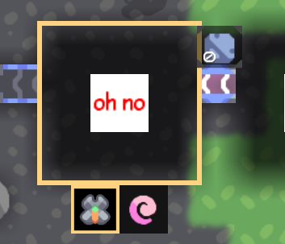

# Json & Javascript

=== "Hjson"

    Create a file, for example, a `mine-crafter.hjson`, in the `content/blocks` folder.
    ```
    content/
    ├─ blocks/
    │  ├─ mine-crafter.hjson

    ```
    Then set its type to `multicraft.MultiCrafter`.
    ```hjson
    type: multicraft.MultiCrafter
    ```
    
    You can add recipes like this:
    
    ```hjson
    recipes: 
    [
    {
      input: ozone/1.5
      output: {
        items: [
          copper/1
          graphite/2
        ]
        power: 2.5
      }
      craftTime: 250.0
    }
    {
      input: {
        items: [
          cyber-io-ic/1 // You can add moded items or fluids
          lead          // the same as "lead/1"
        ]
      }
      output: {
        fluids: [
          cyber-io-cyberion/1.2    
        ]
      }
      craftTime: 210.0
    }
    ]
    ```

=== "Json"

    Create a file, for example, a `mine-crafter.json`, in the `content/blocks` folder.
    ```
    content/
    ├─ blocks/
    │  ├─ mine-crafter.json
    ```
    Then set its type to `multicraft.MultiCrafter`.
    ```json
    "type": "multicraft.MultiCrafter"
    ```
    
    You can add recipes like this:
    
    ```json
    "recipes": [
      {
        "input": "ozone/1.5",
        "output": {
          "items": [
            "copper/1",
            "graphite/2"
          ],
          "power": 2.5
        },
        "craftTime": 250.0
      },
      {
        "input": {
          "items": [
            "cyber-io-ic/1",
            "lead"
          ]
        },
        "output": {
          "fluids": [
            "cyber-io-cyberion/1.2"
          ]
        },
        "craftTime": 210.0
      }
    ]
    ```

=== "JavaScript"

    In a javascript file, you should import the `MultiCrafter` class from `multi-cafter`
    ```javascript
    const multi = require("multi-crafter/lib")
    const mineCrafter = multi.MultiCrafter("mine-crafter")
    ```
    You can add recipes like this:
    ```javascript
    mineCrafter.recipes= [
    { 
      input: "ozone/1.5",
      output: {
        items: ["copper/1","graphite/2"]
        power: 2.5
      },
      craftTime: 250.0
    },{
      input: {
        items: ["cyber-io-ic/1", "lead"]
      },
      output: {
        fluids: ["cyber-io-cyberion/1.2"]
      },
      craftTime: 210.0
    }]
    ```
        
    
### Recipe

A recipe has several fields:

| Field       | Type                     | Note                                        |
|-------------|--------------------------|---------------------------------------------|
| input       | Object, String or List   | alias: [`in`,`i`]                           |
| output      | Object, String or List   | alias: [`out`,`o`]                          |
| crafterTime | number &#124  unit: tick | how long to do a synthesis, can be 0.       |
| icon        | String                   | such as `Icon.lock-open`. see [icon](#icon) |
| iconColor   | String                   | a hex color for icon                        |

### Input and Output

#### String

The `input` or `output` can be a `String`.
If so, it will be considered as an item or fluid.

If there is no amount given, `1` will be the amount as default.
=== "Hjson"

    ```hjson
    input: copper/2
    output: water/1.2
    ```

=== "Json"

    ```json
    "input": "copper/2",
    "output": "water/1.2"
    ```

=== "JavaScript"

    ```javascript
    input: "copper/2",
    output: "water/1.2"
    ```

#### List

The `input` or `output` can be a `List`.
If so, every element will be treated as an item or fluid.

=== "Hjson"

    ```hjson
    input: [copper/2,lead/3]
    output: slag/2.5
    ```

=== "Json"

    ```json
    "input": ["copper/2","lead/3"],
    "output": "slag/2.5"
    ```

=== "JavaScript"

    ```javascript
    input: ["copper/2","lead/3"],
    output: "slag/2.5"
    ```

#### Object

The `input` or `output` can be an `Object`.
With this style, its power is unlimited.

| Key         | Type                           | Optional | Note                                            |
|-------------|--------------------------------|:--------:|-------------------------------------------------|
| items       | String or List                 |    ✔️    | how much item for input/output, default: empty  |
| fluids      | String or List                 |    ✔️    | how much fluid for input/output, default: empty |
| power       | Number &#124  unit: power/tick |    ✔️    | how much power for input/output, default: 0     |
| heat        | Number                         |    ✔️    | how much heat for input/output, default: 0      |
| icon        | String                         |    ✔️    | such as `Icon.lock-open`. see [icon](#icon)     |
| iconColor   | String                         |    ✔️    | a hex color for icon                            |
| craftEffect | String                         |    ✔️    | an independent craft effect for each recipe     |

=== "Hjson"

    ```hjson
    input: {
      items: copper/10
      heat: 5
    }
    output: {
      items: moded-item/1
      fluids: [
        water/1.5, ozone/3
      ]
      power: 1.5
    }
    ```

=== "Json"

    ```json
    "input": {
      "items": "copper/10",
      "heat": 5
    }
    "output": {
      "items": "moded-item/1",
      "fluids": [
        "water/1.5", "ozone/3"
      ],
      "power": 1.5
    }
    ```

=== "JavaScript"

    ```javascript
    input: {
      items: "copper/10",
      heat: 5
    },
    output: {
      items: "moded-item/1",
      fluids: [
        "water/1.5", "ozone/3"
      ],
      power: 1.5
    }
    ```

### Icon

You can customize which icon is used for your recipe selector menu.

If you don't set a dedicated icon, it will find the first one from the recipe.

For example:

=== "alphaaaa"

    { loading=lazy }

    <details>
    <summary>
    icon: alphaaaa
    <br>
    iconColor: F30000
    </summary>
    ```
    recipes: [
    {
      input: ozone/1.5
      output:{
        items : copper
        power : 2
        icon: alphaaaa
        iconColor: "F30000"
      }
      craftTime : 250.0
    }
    {
      input: copper
      output:{
        items : coal
        icon: lock-open
      }
      craftTime : 120
    }
    ]
    ```
    </details>

=== "mono"

    { loading=lazy width="250" }

    <details>
    <summary>
    icon: mono
    </summary>
    ```
    menu: Simple
    recipes:
    [
    {
      input: copper
      output: coal
      craftTime : 60
      icon: mono
    }
    {
      input: copper
      output: ozone
      craftTime : 60
    }
    ]
    ```
    </details>

You can set it to a `String`, it will find the proper icon automatically.

- For a built-in icon, it should start with `Icon.`, such as `Icon.lock-open` or `Icon.trash`.
- For an icon from item, fluid, unit or block, it should be its name, such as `mono`,`phase-heat`.
- For any texture, it should be its name, such as `your-mod-icon` or `alphaaaa`.
